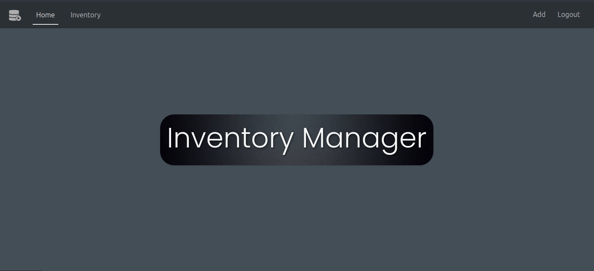
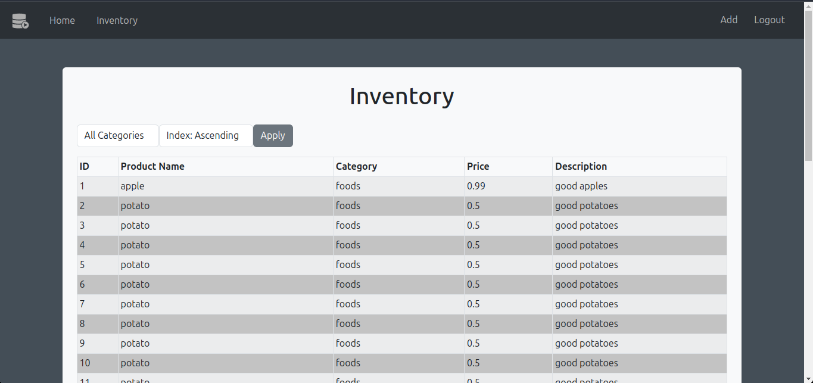
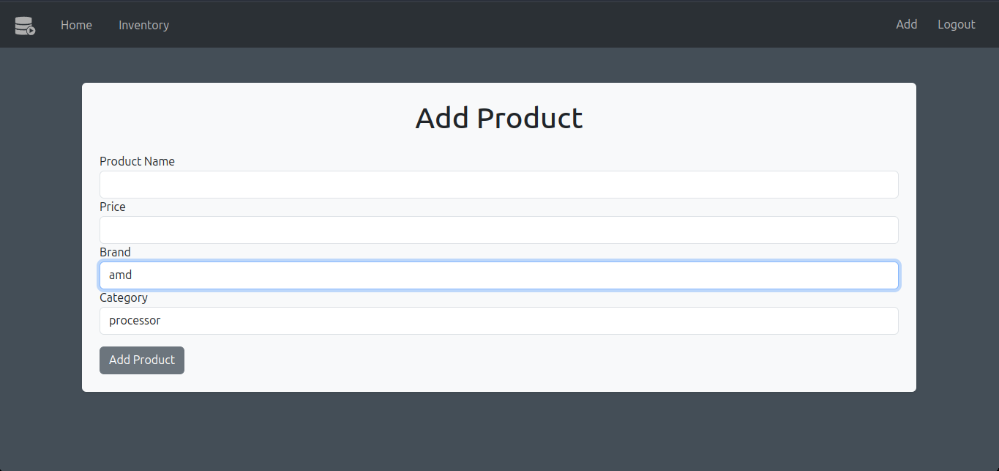

This is just a simple project of a inventory manager built on flask.
It runs a web app that has the table of products in the inventory.

some examples:

For now, you can only delete from the inventory database with SQL queries.

The only way to create an account is directly putting the link or using the button in the login page. That's on purpose, because the signup shouldn't be "public", so if you want to limit the signups, you can just delete from the login page and change the url.

I'm not a front-end dev, and my main focus is databases, so this is just a test project of flask integration, so the design is poor on purpose